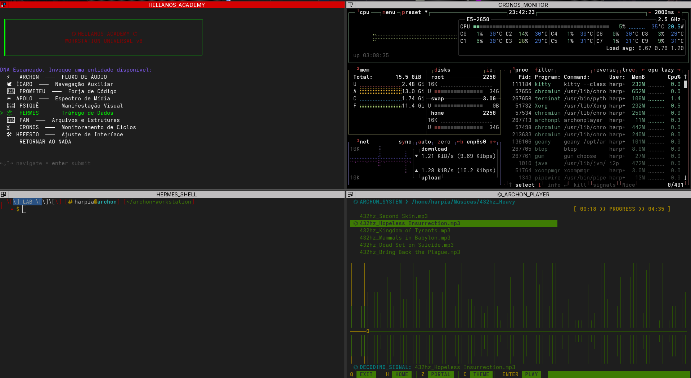

# ⌬ ARCHON-WORKSTATION: LEVEL 8
> **The Divine Engine | Framework de Alta Performance**



---

## ⚡ O que a Matriz oferece:
* **Hellenos Academy Menu**: Menu inteligente auto-adaptativo.
* **Quad-Layout**: Integração nativa com Terminator (4 quadrantes).
* **ArchonPlayer-TUI**: Engine de áudio com espectro em tempo real.

---

## 🚀 Instalação Rápida 

```bash
# 1. Clone o repositório
git clone https://github.com

# 2. Entre no diretório
cd archon-workstation

# 3. Execute o instalador
chmod +x install.sh
./install.sh
```

---

## 🎨 Toque Final: Transparência
Se o fundo ficar preto sólido, instale o **xcompmgr**:
`sudo pacman -S xcompmgr` ou `sudo apt install xcompmgr`

Rode: `xcompmgr -c &`
